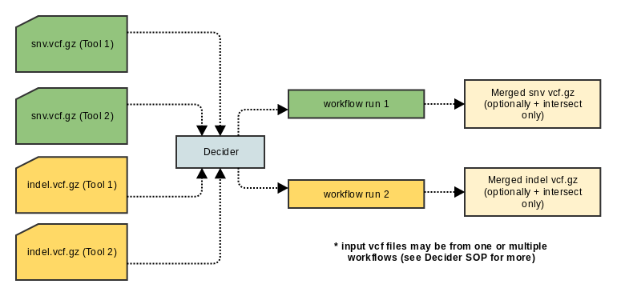

# Variant Merging
a pipeline which utilizes the results of previous efforts to merge vcf files from different somatic callers (MuTect and Strelka)
* GATK
* tabix
* picard

### Pre-processing

The script used at this step performs the following tasks:

* removes non-canonical contigs
* adds GT field (dot or calculated based on SGT, if available)
* removes tool-specific header lines
* injects OICR DCC-specific headers

### Updating Sequence Dictionary and Sorting Vcf

At this step we use picard tools (Broad Institute) to update sequence dictionary using provided reference file (hg19_random.fa) and sort variants according to contig order in the reference.
Combining Variants

We use GATK (Broad Institute) to combine variants using UNIQUIFY option. Given two vcf files with NORMAL/TUMOR columns GATK will produce a vcf with four data columns, two normals and two tumors.
Optional Intersection

Optionally, we can ask to produce an additional vcf with concordant variants only. Normally, a user should not enable this step as the Combining step will mark source-specific variants as well as concordant ones.

### Post-Processing

Post-processing step optionally collapses the vcf into 2-column  (having NORMAL and TUMOR columns) vcf. The rules are simple: there should be no collision of fields, we just need to to take first two data columns (NORMAL) and merge the values + take the last two columns (TUMOR) and merge those too. Flag that controls collapsing will be set by default outside this script. Besides, post-processing step is responsible for compressing and indexing vcf file using bgzip and tabix tools.

## Workflow Options

Parameter|Value|Description
---|---|---
output_dir | seqware-results| A standard SeqWare parameter specifying the sub-directory where the output files will be provisioned
output_prefix | ./ | A standard SeqWare parameter specifying the root directory where the output files will be moved
manual_output | false | Whether or not to use manual output. When false, a random integer will be inserted into the path of the file in order to ensure uniqueness. When true, the output files will be moved to the location of output_prefix/output_dir
identifier | | Identifier produced using Decider: FileAttributes.getLibrarySample() returns the necessary information
queue | | queue on sge cluster. Normally, should not be changed but is available for customization
ref_fasta | | reference fasta file used by GATK and Picard tools
gatk_dir | | directory containing GATK jar (automatically constructed). Points to the bundled GATK
gatk_dbsnp_vcf | | path to dbsnp data used by GATK
collapse_vcf | true | Flag that determines if we want to collapse the output of CombineVcf walker (GATK) 4 columns -> 2 columns
pass_only | true | Tells the workflow to use only PASS calls in the combined vcf
do_intersect | false | Flag that instructs the workflow to produce an additional vcf with concordant calls (should not be set normally, but available)
picard_memory | | Memory used by picard tools

## Decider Options

Parameter|Value|Description
---|---|---
output-path | ./ | Optional: the path where the files should be copied to after analysis. Corresponds to output-prefix in .ini file
output-folder | seqware-results | Optional: the name of the folder to put the output into relative to the output-path. Corresponds to output-dir in INI file.
queue | | Optional: Set the queue for workflow's jobs on sge cluster
manual-output | false | Optional, Set the manual output either to true or false
template-type | | Optional. Set the template type to limit the workflow runs so that it runs on data only of this template type
variant-type | | Optional: specify the type of calls (snv, indels) to limit the analysis to this call type
reference-fasta | | Optional: Reference assembly in fasta format.
Do-intersect | true | Optional: Emit variants called by two SNV callers in addition to the full set of calls
do-collapse | true | Optional: Collapse 4-columns produced by CombineVariants into two columns
pass-only | true | Optional:  Output PASS calls only for the overlap
variant-callers | | Optional: Comma-separated list of names for two variant callers that we want to use for merging
verbose | | Enable Verbose Logging
