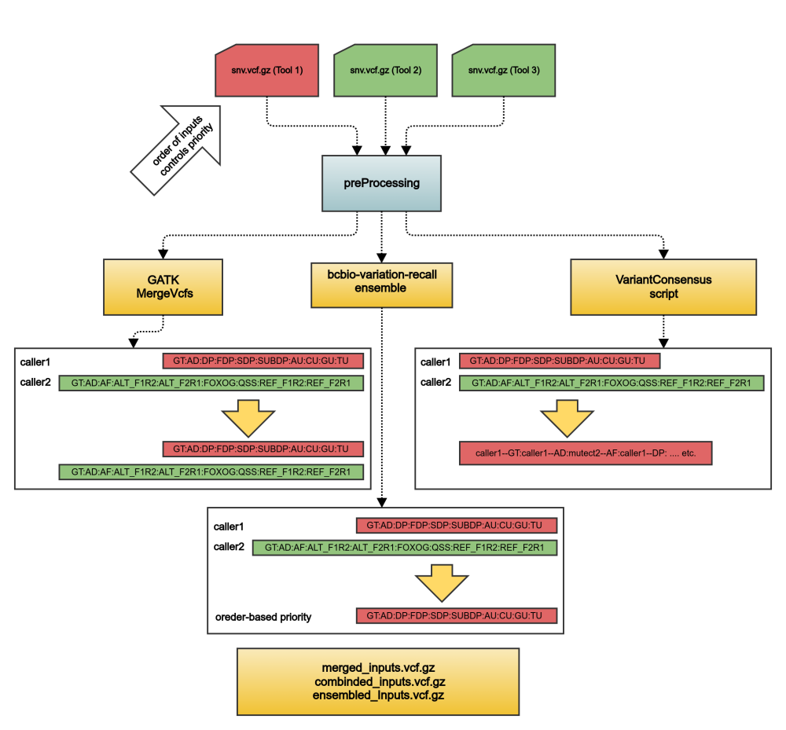

# variantMerging

VariantMerging 2.1, a workflow for combining variant calls from SNV analyses done with different callers
### Pre-processing

The script used at this step performs the following tasks:

* removes non-canonical contigs
* adds GT and AD fields (dot or calculated based on NT, SGT, if available)
* removes tool-specific header lines

## Overview



## Dependencies

* [java 9](https://github.com/AdoptOpenJDK/openjdk9-binaries/releases/download/jdk-9%2B181/OpenJDK9U-jdk_x64_linux_hotspot_9_181.tar.gz)
* [tabix 0.2.6](https://sourceforge.net/projects/samtools/files/tabix/tabix-0.2.6.tar.bz2)
* [gatk 4.2.6.1](https://gatk.broadinstitute.org)
* [DISCVR-Seq Toolkit 1.3.21](https://bimberlab.github.io/DISCVRSeq)


## Usage

### Cromwell
```
java -jar cromwell.jar run variantMerging.wdl --inputs inputs.json
```

### Inputs

#### Required workflow parameters:
Parameter|Value|Description
---|---|---
`inputVcfs`|Array[Pair[File,String]]|Pairs of vcf files (SNV calls from different callers) and metadata string (producer of calls).
`preprocessVcf.referenceId`|String|String that shows the id of the reference assembly
`preprocessVcf.referenceFasta`|String|path to the reference FASTA file
`combineVariants.referenceFasta`|String|path to the reference FASTA file
`combineVariants.priority`|String|Comma-separated list defining priority of workflows when combining variants
`postprocessVcfs.referenceId`|String|String that shows the id of the reference assembly


#### Optional workflow parameters:
Parameter|Value|Default|Description
---|---|---|---
`outputFileNamePrefix`|String|""|Output prefix to prefix output file names with.


#### Optional task parameters:
Parameter|Value|Default|Description
---|---|---|---
`preprocessVcf.preprocessScript`|String|"$VARMERGE_SCRIPTS_ROOT/bin/vcfVetting.py"|path to preprocessing script
`preprocessVcf.modules`|String|"gatk/4.2.6.1 varmerge-scripts/1.9 tabix/0.2.6"|modules for running preprocessing
`preprocessVcf.jobMemory`|Int|12|memory allocated to preprocessing, in gigabytes
`preprocessVcf.timeout`|Int|10|timeout in hours
`mergeVcfs.timeout`|Int|20|timeout in hours
`mergeVcfs.jobMemory`|Int|12|Allocated memory, in GB
`mergeVcfs.modules`|String|"gatk/4.2.6.1 tabix/0.2.6"|modules for this task
`combineVariants.modules`|String|"discvrseq/1.3.21"|modules for running preprocessing
`combineVariants.dscrvToolsJar`|String|"$DISCVRSEQ_ROOT/bin/DISCVRSeq-1.3.21.jar"|DISCVR tools JAR
`combineVariants.jobMemory`|Int|12|memory allocated to preprocessing, in GB
`combineVariants.timeout`|Int|20|timeout in hours
`postprocessVcfs.postprocessScript`|String|"$VARMERGE_SCRIPTS_ROOT/bin/vcfPostprocessing.py"|Path to post-process script
`postprocessVcfs.timeout`|Int|20|timeout in hours
`postprocessVcfs.jobMemory`|Int|12|Allocated memory, in GB
`postprocessVcfs.modules`|String|"tabix/0.2.6 varmerge-scripts/1.9"|modules for this task


### Outputs

Output | Type | Description
---|---|---
`mergedVcf`|File|vcf file containing all variant calls
`mergedIndex`|File|tabix index of the vcf file containing all variant calls
`combinedVcf`|File|combined vcf file containing all variant calls
`combinedIndex`|File|index of combined vcf file containing all variant calls
`postprocessedVcf`|File|post-processed combined vcf file with updated set field for overlapping calls
`postprocessedIndex`|File|index of post-processed vcf file


## Commands
 
 This section lists command(s) run by variantMerging workflow
 
 ### Preprocessing
  
 ```
  python3 PREPROCESSING_SCRIPT VCF_FILE -o VCF_FILE_BASENAME_tmp.vcf -r REFERENCE_ID
  
  bgzip -c VCF_FILE_BASENAME_tmp.vcf > VCF_FILE_BASENAME_tmp.vcf.gz
  gatk SortVcf -I VCF_FILE_BASENAME_tmp.vcf.gz 
               -R REF_FASTA 
               -O VCF_FILE_BASENAME_processed.vcf.gz
 ```
  
 ### Merging vcf files
  
 This is a simple concatenation of input vcfs, there may be duplicate entries for the same call if multiple callers discover the same variant.
  
 ```
  gatk MergeVcfs -I INPUT_VCFS -O PREFIX_mergedVcfs.vcf.gz
  
 ```
  
 ### Combining vcf files
  
 A more complex merging with GATK CombineVariants: depending on priority assigned to the callers matching fields will be ranked according this settings and only the values from the caller with highest priority will be used.
  
 ```
  Embedded Python code runs the CombineVariants command:
 
  java -Xmx[JOB_MEMORY]G -jar DISCVRSeq-1.3.21.jar
       MergeVcfsAndGenotypes INPUTS
       -R REF_FASTA
       -O PREFIX_combined.vcf.gz
       --genotypeMergeOption PRIORITIZE
       -priority PRIORITY
 
 ```
 
 ### Post-processing combined vcf files
 
 DISCVRSeq produces combined variants with set field which does not allow to identify consensus calls and other calls which
 are made by multiple callers
 
 ```
  Custom Python code runs to update set flags in vcf file produced by Combining variants with MergeVcfsAndGenotypes:
 
  python3 POSTROCESSING_SCRIPT -m MERGED_VCF_FILE -c COMBINED_VCF_FILE -o VCF_FILE_BASENAME_tmp.vcf -r REFERENCE_ID 
  bgzip -c VCF_FILE_BASENAME_tmp.vcf > OUTPUT_PREFIX_combinedPostprocessedVcfs.vcf.gz
  tabix -p vcf OUTPUT_PREFIX_combinedPostprocessedVcfs.vcf.gz
 
 ```
 
 ## Support

For support, please file an issue on the [Github project](https://github.com/oicr-gsi) or send an email to gsi@oicr.on.ca .

_Generated with generate-markdown-readme (https://github.com/oicr-gsi/gsi-wdl-tools/)_
